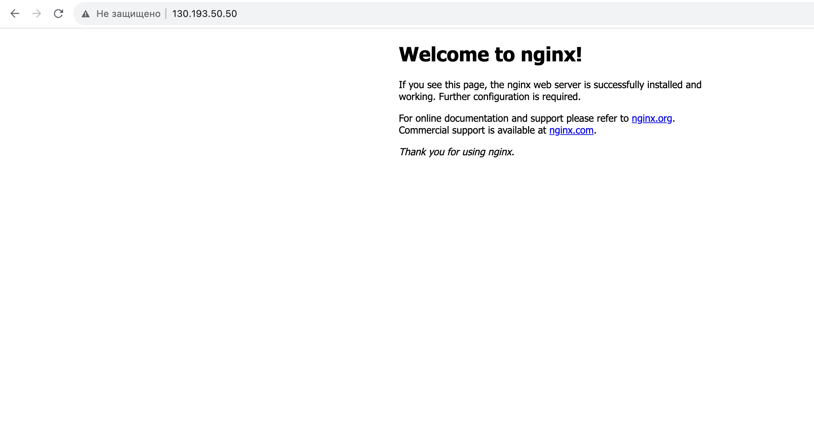
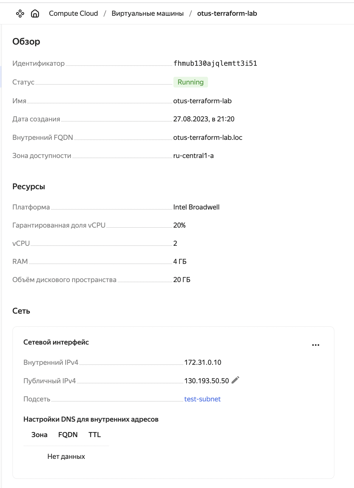

### Домашнее задание
первый терраформ скрипт

#### Цель:
реализовать первый терраформ скрипт.

#### Описание/Пошаговая инструкция выполнения домашнего задания:
#### Необходимо:
1. реализовать терраформ для разворачивания одной виртуалки в yandex-cloud
1. запровиженить nginx с помощью ansible

#### Формат сдачи
- репозиторий с терраформ манифестами
- README файл

#### Критерии оценки:
преподаватель с помощью terraform apply должен получить развернутый стенд

### Выполнение домашнего задания

#### Разворачивание вируалки
Клонируем код:
```
https://github.com/StownCraft/otus-learn.git
```
Переходим в директорию с домашним заданием:
```
cd otus-learn/lab-1
```
Получаем токен:
```
export YC_TOKEN=$(yc iam create-token)
export TF_VAR_yc_token=$YC_TOKEN
```
Отредактируем файл `provider.tf`. В блоке `provider "yandex"` указываем свои `cloud_id` и `folder_id`:
```
provider "yandex" {
  cloud_id  = "<sensitive_data>"
  folder_id = "<sensitive_data>"
}
```
Если в директории `~/.ssh/` нет ключей `id_rsa` и публичного `id_rsa.pub`, создаём их командой `ssh-keygen`.

Для инициализации проекта запустим команду:
```
terraform init
```
Следующей командой увидим план предстоящего выполнения проекта:
```
terraform plan

```
Построим инфраструктуру с помощью следующей команды:
```
terraform apply
```
После успешного выполнения, можем зайти на публичный адрес созданной виртуалки и мы должны увидеть приветственную страницу nginx. Это значит, что все прошло успешно.


Также можно проверить в облаке созданные ресурсы


Удалим полностью все созданные ресурсы с помощью команды:
```
terraform destroy
```