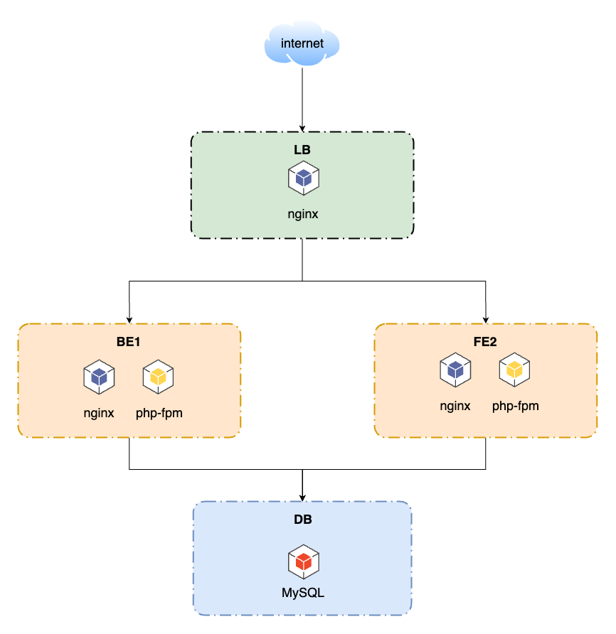
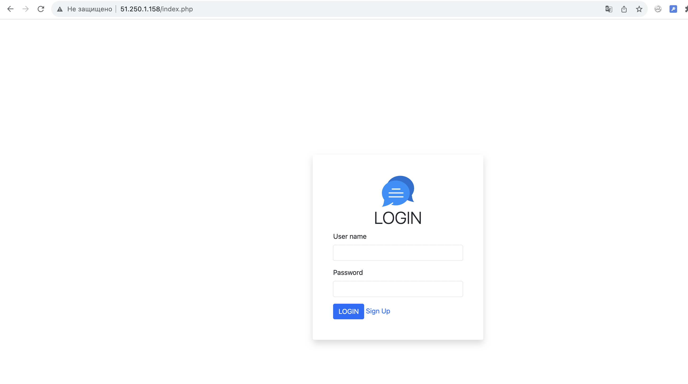
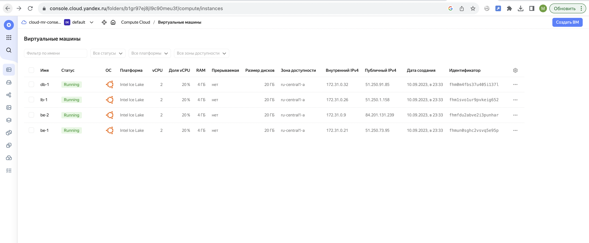

### Домашнее задание
Настраиваем балансировку веб-приложения

#### Цель:
научиться использовать Nginx в качестве балансировщика
В результате получаем рабочий пример Nginx в качестве балансировщика, и базовую отказоустойчивость бекенда.

#### Описание/Пошаговая инструкция выполнения домашнего задания:
#### Необходимо:
1. развернуть 4 виртуалки терраформом в яндекс облаке
1. 1 виртуалка - Nginx - с публичным IP адресом
1. 2 виртуалки - бэкенд на выбор студента ( любое приложение из гитхаба - uwsgi/unicorn/php-fpm/java) + nginx со статикой
1. 1 виртуалкой с БД на выбор mysql/mongodb/postgres/redis.
1. репозиторий в github: README, схема, манифесты терраформ и ансибл
1. стенд должен разворачиваться с помощью terraform и ansible
1. при отказате (выключение) виртуалки с бекендом система должна продолжать работать

#### Описание/Пошаговая инструкция выполнения домашнего задания:
В работе должны применяться:

- terraform
- ansible
- nginx;
- uwsgi/unicorn/php-fpm;
- некластеризованная бд mysql/mongodb/postgres/redis.-

#### Критерии оценки:
Статус "Принято" ставится при выполнении перечисленных требований.

### Выполнение домашнего задания

### Серверная архитектура


#### Разворачивание вируалки
Клонируем код:
```
git clone https://github.com/StownCraft/otus-learn.git
```
Переходим в директорию с домашним заданием:
```
cd otus-learn/lab-2
```
Получаем токен:
```
export YC_TOKEN=$(yc iam create-token)
export TF_VAR_yc_token=$YC_TOKEN
```
Отредактируем файл `provider.tf`. В блоке `provider "yandex"` указываем свои `cloud_id` и `folder_id`:
```
provider "yandex" {
  cloud_id  = "<sensitive_data>"
  folder_id = "<sensitive_data>"
}
```
Если в директории `~/.ssh/` нет ключей `id_rsa` и публичного `id_rsa.pub`, создаём их командой `ssh-keygen`.

Для инициализации проекта запустим команду:
```
terraform init
```
Следующей командой увидим план предстоящего выполнения проекта:
```
terraform plan

```
Построим инфраструктуру с помощью следующей команды:
```
terraform apply
```

Запускаем ансибл для установки служб и деплоя приложения:
```
ANSIBLE_HOST_KEY_CHECKING=False ansible-playbook -u ec2-user -i './ansible/hosts' --private-key ~/.ssh/id_rsa ./ansible/main.yml
```

После успешного выполнения, можем зайти на публичный адрес созданной виртуалки и мы должны увидеть страницу входа в приложение. Это значит, что все прошло успешно.


Также можно проверить в облаке созданные ресурсы


Удалим полностью все созданные ресурсы с помощью команды:
```
terraform destroy
```