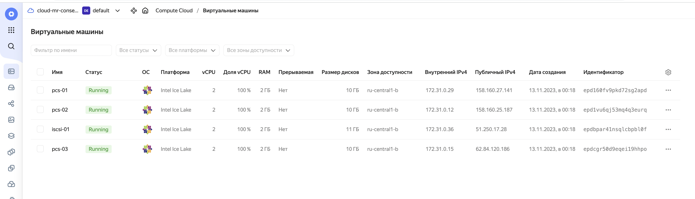

### Домашнее задание
Реализация GFS2 хранилища на виртуалках под виртуалбокс

#### Цель:
развернуть в VirtualBox следующую конфигурацию с помощью terraform

виртуалка с iscsi
3 виртуальные машины с разделяемой файловой системой GFS2 поверх cLVM
должен быть настроен fencing для VirtualBox - https://github.com/ClusterLabs/fence-agents/tree/master/agents/vbox
для сдачи
terraform манифесты
ansible роль
README file


#### Критерии оценки:
Статус "Принято" ставится при выполнении перечисленных требований.
Задание со звездочкой выполняется по желанию.

### Выполнение домашнего задания


#### Разворачивание вируалки
Клонируем код:
```
git clone https://github.com/StownCraft/otus-learn.git
```
Переходим в директорию с домашним заданием:
```
cd otus-learn/lab-3
```
Получаем токен:
```
export YC_TOKEN=$(yc iam create-token)
export TF_VAR_yc_token=$YC_TOKEN
```
Отредактируем файл `provider.tf`. В блоке `provider "yandex"` указываем свои `cloud_id` и `folder_id`:
```
provider "yandex" {
  cloud_id  = "<sensitive_data>"
  folder_id = "<sensitive_data>"
}
```
Если в директории `~/.ssh/` нет ключей `id_rsa` и публичного `id_rsa.pub`, создаём их командой `ssh-keygen`.

Для инициализации проекта запустим команду:
```
terraform init
```
Следующей командой увидим план предстоящего выполнения проекта:
```
terraform plan

```
Построим инфраструктуру с помощью следующей команды:
```
terraform apply
```

Запускаем для деплоя приложений:
```
ANSIBLE_HOST_KEY_CHECKING=False ansible-playbook -u 'ec2-user' -i './ansible/inventory.ini' --private-key '~/.ssh/id_rsa' ./ansible/main.yml
```

После успешного выполнения, можем зайти на виртуалку и посмотреть список scsi-устройств:
```
[root@pcs-01 ~]# lsscsi
[0:0:0:0]    disk    LIO-ORG  file0            4.0   /dev/sda 
[0:0:0:1]    disk    LIO-ORG  block0           4.0   /dev/sdb 
[0:0:0:2]    disk    LIO-ORG  ram0             4.0   /dev/sdc
```

Состояние pcs кластера:
```
[root@pcs-01 ~]# pcs status
Cluster name: hacluster
Cluster Summary:
  * Stack: corosync (Pacemaker is running)
  * Current DC: pcs-02.mydomain.test (version 2.1.6-8.el8-6fdc9deea29) - partition with quorum
  * Last updated: Sun Nov 12 21:43:32 2023 on pcs-01.mydomain.test
  * Last change:  Sun Nov 12 21:28:22 2023 by root via cibadmin on pcs-01.mydomain.test
  * 3 nodes configured
  * 21 resource instances configured

Node List:
  * Online: [ pcs-01.mydomain.test pcs-02.mydomain.test pcs-03.mydomain.test ]

Full List of Resources:
  * Clone Set: dlm-clone [dlm]:
    * Started: [ pcs-01.mydomain.test pcs-02.mydomain.test pcs-03.mydomain.test ]
  * Clone Set: lvmlockd-clone [lvmlockd]:
    * Started: [ pcs-01.mydomain.test pcs-02.mydomain.test pcs-03.mydomain.test ]
  * Clone Set: fileio_cluster_vg-clone [fileio_cluster_vg]:
    * Started: [ pcs-01.mydomain.test pcs-02.mydomain.test pcs-03.mydomain.test ]
  * Clone Set: block_cluster_vg-clone [block_cluster_vg]:
    * Started: [ pcs-01.mydomain.test pcs-02.mydomain.test pcs-03.mydomain.test ]
  * Clone Set: ramdisk_cluster_vg-clone [ramdisk_cluster_vg]:
    * Started: [ pcs-01.mydomain.test pcs-02.mydomain.test pcs-03.mydomain.test ]
  * Clone Set: fileio_cluster_fs-clone [fileio_cluster_fs]:
    * Started: [ pcs-01.mydomain.test pcs-02.mydomain.test pcs-03.mydomain.test ]
  * Clone Set: block_cluster_fs-clone [block_cluster_fs]:
    * Started: [ pcs-01.mydomain.test pcs-02.mydomain.test pcs-03.mydomain.test ]

Daemon Status:
  corosync: active/enabled
  pacemaker: active/enabled
  pcsd: active/enabled
```

LVM:
```
[root@pcs-01 ~]# vgdisplay
  --- Volume group ---
  VG Name               ramdisk_cluster_vg
  System ID             
  Format                lvm2
  Metadata Areas        1
  Metadata Sequence No  3
  VG Access             read/write
  VG Status             resizable
  MAX LV                0
  Cur LV                1
  Open LV               0
  Max PV                0
  Cur PV                1
  Act PV                1
  VG Size               1020.00 MiB
  PE Size               4.00 MiB
  Total PE              255
  Alloc PE / Size       255 / 1020.00 MiB
  Free  PE / Size       0 / 0   
  VG UUID               tHiQuS-c5Xk-B1kI-gtcY-2REI-yalB-cm2yn3
   
  --- Volume group ---
  VG Name               block_cluster_vg
  System ID             
  Format                lvm2
  Metadata Areas        1
  Metadata Sequence No  3
  VG Access             read/write
  VG Status             resizable
  MAX LV                0
  Cur LV                1
  Open LV               1
  Max PV                0
  Cur PV                1
  Act PV                1
  VG Size               1020.00 MiB
  PE Size               4.00 MiB
  Total PE              255
  Alloc PE / Size       255 / 1020.00 MiB
  Free  PE / Size       0 / 0   
  VG UUID               M2zLX0-pTQV-PBJD-UWPw-0QXl-SCMH-u4XiiK
   
  --- Volume group ---
  VG Name               fileio_cluster_vg
  System ID             
  Format                lvm2
  Metadata Areas        1
  Metadata Sequence No  3
  VG Access             read/write
  VG Status             resizable
  MAX LV                0
  Cur LV                1
  Open LV               1
  Max PV                0
  Cur PV                1
  Act PV                1
  VG Size               1016.00 MiB
  PE Size               4.00 MiB
  Total PE              254
  Alloc PE / Size       254 / 1016.00 MiB
  Free  PE / Size       0 / 0   
  VG UUID               BBDENW-RDPN-Zws5-7tgF-Df0u-Nvi6-m8KfN8
   
[root@pcs-01 ~]# lvdisplay 
  --- Logical volume ---
  LV Path                /dev/ramdisk_cluster_vg/ram0_cluster_lv
  LV Name                ram0_cluster_lv
  VG Name                ramdisk_cluster_vg
  LV UUID                YQGaBO-pz2Q-f6sa-mYSC-cSsx-RKAp-C5tYSd
  LV Write Access        read/write
  LV Creation host, time pcs-01.mydomain.test, 2023-11-12 21:27:42 +0000
  LV Status              available
  # open                 0
  LV Size                1020.00 MiB
  Current LE             255
  Segments               1
  Allocation             inherit
  Read ahead sectors     auto
  - currently set to     8192
  Block device           253:5
   
  --- Logical volume ---
  LV Path                /dev/block_cluster_vg/block0_cluster_lv
  LV Name                block0_cluster_lv
  VG Name                block_cluster_vg
  LV UUID                3dYNmY-fLcZ-6jlb-oZKY-rgQz-acyQ-91KlwR
  LV Write Access        read/write
  LV Creation host, time pcs-01.mydomain.test, 2023-11-12 21:27:41 +0000
  LV Status              available
  # open                 1
  LV Size                1020.00 MiB
  Current LE             255
  Segments               1
  Allocation             inherit
  Read ahead sectors     auto
  - currently set to     8192
  Block device           253:4
   
  --- Logical volume ---
  LV Path                /dev/fileio_cluster_vg/file0_cluster_lv
  LV Name                file0_cluster_lv
  VG Name                fileio_cluster_vg
  LV UUID                KdRe3H-Qjeb-4u9r-OmfT-75TK-dDOc-pho4W7
  LV Write Access        read/write
  LV Creation host, time pcs-01.mydomain.test, 2023-11-12 21:27:39 +0000
  LV Status              available
  # open                 1
  LV Size                1016.00 MiB
  Current LE             254
  Segments               1
  Allocation             inherit
  Read ahead sectors     auto
  - currently set to     32768
  Block device           253:3
```

GFS2:
```
[root@pcs-01 ~]# lsblk -f
NAME                                   FSTYPE      LABEL                 UUID                                   MOUNTPOINT
sda                                                                                                             
`-otusFileio                           LVM2_member                       4w88up-n9DT-5zKB-TPkd-MyZq-ats4-DfBFIw 
  `-fileio_cluster_vg-file0_cluster_lv gfs2        hacluster:gfs2-fileio 40f1d680-5322-4d93-abc8-1846a7e634d4   /mnt/lvm_cluster_file0
sdb                                                                                                             
`-otusBlock                            LVM2_member                       MkaF9i-WWIv-C700-hXPc-F01w-sUqQ-e9611V 
  `-block_cluster_vg-block0_cluster_lv gfs2        hacluster:gfs2-block  43ea8e13-2360-40d6-8ad1-35209bbf5fa6   /mnt/lvm_cluster_block0
sdc                                                                                                             
`-otusRamdisk                          LVM2_member                       mqfJAT-qx6B-QBBF-QGmd-1U3G-9hcP-SkxeM8 
  `-ramdisk_cluster_vg-ram0_cluster_lv                                                                          
vda                                                                                                             
|-vda1                                                                                                          
`-vda2                                 xfs                               73edbcff-1640-4c19-a650-ba9c992984de   /
```

Также можно проверить в облаке созданные ресурсы


Удалим полностью все созданные ресурсы с помощью команды:
```
terraform destroy
```