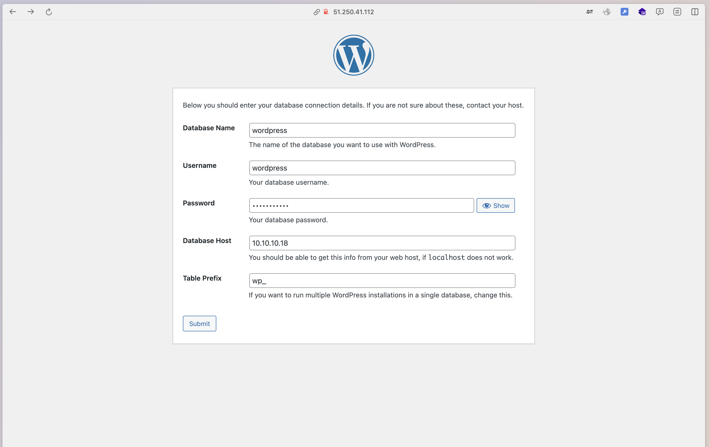

### Домашнее задание
Настройка конфигурации веб приложения под высокую нагрузку

#### Цель:
terraform (или vagrant) и ansible роль для развертывания серверов веб приложения под высокую нагрузку и отказоустойчивость
в работе должны применяться:

- keepalived, (в случае использовать vagrant и virtualbox), load balancer от yandex в случае использования яндекс клауд
- nginx,
- uwsgi/unicorn/php-fpm
- некластеризованная бд mysql/mongodb/postgres/redis

#### Описание/Пошаговая инструкция выполнения домашнего задания:
1. Создать несколько инстансов с помощью терраформ (2 nginx, 2 backend, 1 db);
2. Развернуть nginx и keepalived на серверах nginx при помощи ansible
3. Развернуть бэкенд способный работать по uwsgi/unicorn/php-fpm и базой. (Можно взять что нибудь из Django) при помощи ansible.
4. Развернуть gfs2 для бэкенд серверах, для хранения статики
5. Развернуть бд для работы бэкенда при помощи ansbile
6. Проверить отказоустойчивость системы при выходе из строя серверов backend/nginx

#### Критерии оценки:
Статус "Принято" ставится при выполнении перечисленных требований.

#### Разворачивание вируалки
Клонируем код:
```
git clone https://github.com/StownCraft/otus-learn.git
```
Переходим в директорию с домашним заданием:
```
cd otus-learn/lab-4
```
Получаем токен:
```
export YC_TOKEN=$(yc iam create-token)
export TF_VAR_yc_token=$YC_TOKEN
```
Отредактируем файл `provider.tf`. В блоке `provider "yandex"` указываем свои `cloud_id` и `folder_id`:
```
provider "yandex" {
  cloud_id  = "<sensitive_data>"
  folder_id = "<sensitive_data>"
}
```
Если в директории `~/.ssh/` нет ключей `id_rsa` и публичного `id_rsa.pub`, создаём их командой `ssh-keygen`.

Для инициализации проекта запустим команду:
```
terraform init
```
Следующей командой увидим план предстоящего выполнения проекта:
```
terraform plan

```
Построим инфраструктуру с помощью следующей команды:
```
terraform apply
```

Запускаем для деплоя приложений:
```
ANSIBLE_HOST_KEY_CHECKING=False ansible-playbook -u 'ec2-user' -i './ansible/inventory.ini' --private-key '~/.ssh/id_rsa' ./ansible/main.yml
```

После успешного выполнения, можем зайти в панель управления и увидеть созданные ВМ и NLB:


Теперь можем зайти на сайт по адресу NLB и установить wordpress




Также можем открыть логи бека и увидеть, что балансировка трафика работает
